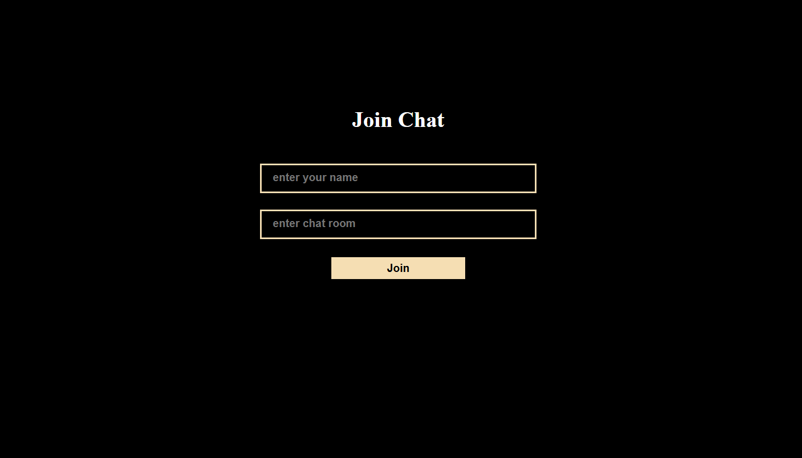
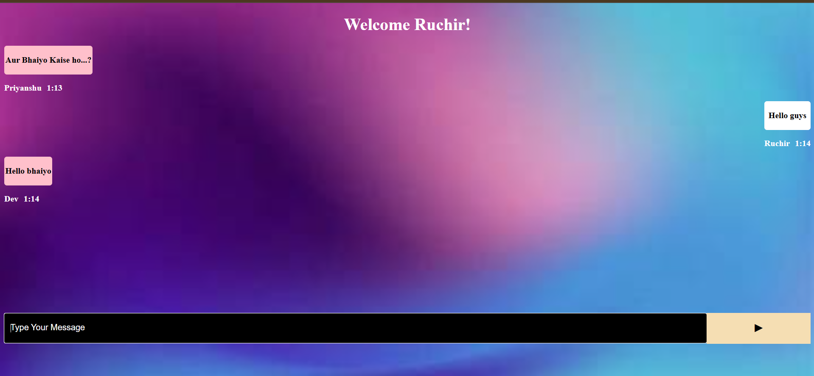
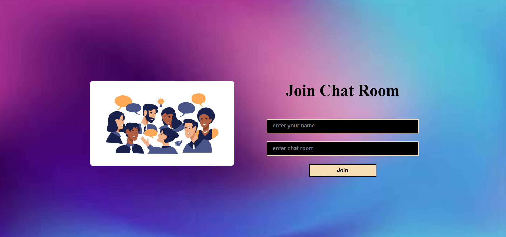

# 💬 Live Chat App — React + Node.js + Socket.IO

Real-time chat application built with **React**, **Node.js**, and **Socket.IO** that enables users to join chat rooms and exchange messages live, complete with notification sounds and auto-scrolling chat UI.

🔗 **Live Site**: [https://live-chat-react-nodejs-socket-io-1.onrender.com/](https://live-chat-react-nodejs-socket-io-1.onrender.com/)

---

## ⚡ Features

- 🧑‍🤝‍🧑 Join custom chat rooms with any name
- 💬 Real-time messaging with WebSocket (Socket.IO)
- 🔔 Message sent/received sound notifications
- 🖼️ Responsive chat UI with sender/receiver alignment
- ⬇️ Auto-scroll to latest message
- 🌐 Deployed on **Render** (both frontend and backend)

---

## 📸 Screenshots

| Join Room View  | Chat View |
|------------------|------------|
|  |  |
|  | |
---

## 🔧 Tech Stack

| Frontend | Backend | Real-time |
|----------|---------|-----------|
| React + Vite | Node.js + Express | Socket.IO |

---

## 🚀 How to Run Locally

### 1. Clone the Repository

```bash
git clone https://github.com/your-username/live-chat-react-nodejs-socket-io.git
cd live-chat-react-nodejs-socket-io
2. Install Dependencies
Server (Backend)
bash
Copy
Edit
cd server
npm install
Client (Frontend)
bash
Copy
Edit
cd client
npm install
3. Start Development Servers
Start Backend
bash
Copy
Edit
cd server
node server.js
Start Frontend
bash
Copy
Edit
cd client
npm run dev
4. Open App
Visit: http://localhost:5173 (or your frontend port)

🌐 Deployment on Render
Backend: Deployed as a Web Service (Node environment, node server.js)

Frontend: Deployed as a Static Site (Vite built folder, output: dist)

Live URL: https://live-chat-react-nodejs-socket-io-1.onrender.com/

📁 Project Structure
csharp
Copy
Edit
├── client/                 # React frontend
│   ├── App.jsx
│   ├── Chat.jsx
│   └── ...
├── server/                # Express backend
│   └── server.js
├── public/
├── package.json
└── README.md
🎵 Assets Used
music.wav, iphone.mp3: Sound notifications for joining and receiving messages

🙌 Credits
Developed by Your Name

📄 License
MIT License

yaml
Copy
Edit

---

Would you like me to customize this further with your name or GitHub username and insert real screenshots?


